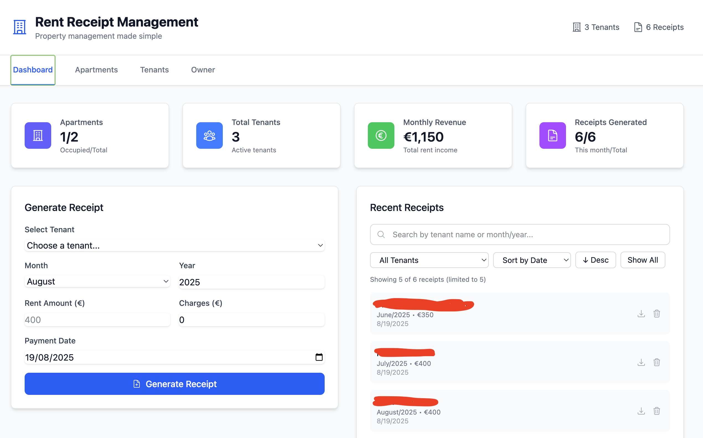

# 🏠 Rent Receipt Management System



A modern fullstack web application for property managers to handle tenant information and generate rent receipts with ease. Built with React, Node.js, and designed for French property management requirements.

## ✨ Features

### 👥 Tenant Management
- Complete CRUD operations for tenant information
- Store contact details, rental amounts, and charges
- Auto-fill rent amounts when generating receipts

### 🧾 Receipt Generation
- Generate PDF rent receipts in French ("Quittance de Loyer")
- Customizable payment dates for accurate record-keeping
- Professional formatting with landlord signature support
- Automatic filename generation with tenant and period info

### 📊 Receipt Management
- **Advanced Search**: Search by tenant name or month/year
- **Smart Filtering**: Filter receipts by specific tenants
- **Flexible Sorting**: Sort by date, tenant name, or rental period
- **View Options**: Toggle between recent receipts and complete history
- Download and delete receipts with one click

### 🎨 Modern Interface
- Clean, responsive design built with React and Tailwind CSS
- Real-time notifications for user feedback
- Intuitive dashboard with key statistics
- Mobile-friendly responsive layout

## 🛠️ Tech Stack

### Backend
- **Node.js** with Express.js framework
- **SQLite** database for data persistence
- **PDFKit** for professional PDF receipt generation
- **Security middleware**: Helmet, CORS, Rate limiting
- Environment-based configuration

### Frontend
- **React 18** with Vite for fast development
- **Redux Toolkit** for state management
- **Tailwind CSS** for modern styling
- **Heroicons** for consistent iconography
- **Axios** for API communication

## Project Structure

```
my-fullstack-app/
├── server/
│   ├── src/
│   │   ├── controllers/     # Request handlers
│   │   ├── models/          # Data models
│   │   ├── routes/          # API routes
│   │   ├── database/        # Database setup
│   │   └── utils/           # Utilities (PDF generation)
│   ├── receipts/            # Generated PDF files
│   ├── database/            # SQLite database files
│   └── index.js             # Server entry point
└── client/
    ├── src/
    │   ├── components/      # React components
    │   ├── store/           # Redux store and slices
    │   ├── services/        # API services
    │   └── App.jsx          # Main app component
    └── public/              # Static assets
```

## 🚀 Getting Started

### Prerequisites
- Node.js (v16 or higher)
- npm or yarn package manager

### Quick Start

1. **Clone the repository**
   ```bash
   git clone <repository-url>
   cd my-fullstack-app
   ```

2. **Backend Setup**
   ```bash
   cd server
   npm install
   npm start
   ```
   Server runs on http://localhost:5002

3. **Frontend Setup** (in a new terminal)
   ```bash
   cd client
   npm install
   npm run dev
   ```
   Client runs on http://localhost:3000

4. **Access the application**
   Open your browser and navigate to http://localhost:3000

## 📡 API Endpoints

### Tenants
- `GET /api/tenants` - Get all tenants
- `POST /api/tenants` - Create new tenant  
- `PUT /api/tenants/:id` - Update tenant
- `DELETE /api/tenants/:id` - Delete tenant

### Receipts
- `POST /api/receipts/generate` - Generate new receipt (with payment date)
- `GET /api/receipts` - Get all receipts
- `GET /api/receipts/tenant/:tenantId` - Get receipts by tenant
- `GET /api/receipts/download/:id` - Download receipt PDF
- `DELETE /api/receipts/:id` - Delete receipt

## ⚙️ Environment Variables

### Server (.env)
```env
PORT=5002
NODE_ENV=development
DB_PATH=./database/rentReceipts.db
RECEIPTS_DIR=./receipts
CORS_ORIGIN=http://localhost:3000
```

### Client (.env)
```env
VITE_API_URL=http://localhost:5002/api
```

## 🔒 Security Features

- **Rate limiting**: 100 requests per 15 minutes per IP
- **CORS protection**: Configured for secure cross-origin requests
- **Security headers**: Helmet middleware for enhanced security
- **Input validation**: Server-side validation for all endpoints
- **SQL injection prevention**: Parameterized queries throughout

## 🏗️ Development

### Architecture Principles
- **Modular design**: Separated concerns with clear component boundaries
- **Environment-based config**: Different settings for dev/prod environments
- **Error handling**: Comprehensive error catching and user feedback
- **Clean code**: Consistent formatting and naming conventions
- **Responsive UI**: Mobile-first design approach

### Key Components
- **Dashboard**: Statistics overview with quick actions
- **Tenant Management**: Full CRUD operations with form validation
- **Receipt Generation**: PDF creation with French formatting
- **Receipt Management**: Advanced search, filter, and sort capabilities
- **Notifications**: Real-time user feedback system

## 🤝 Contributing

1. Fork the repository
2. Create a feature branch (`git checkout -b feature/amazing-feature`)
3. Commit your changes (`git commit -m 'Add amazing feature'`)
4. Push to the branch (`git push origin feature/amazing-feature`)
5. Open a Pull Request

## 📄 License

This project is licensed under the MIT License - see the LICENSE file for details.

## 🆘 Support

If you encounter any issues or have questions:
1. Check the existing issues on GitHub
2. Create a new issue with detailed information
3. Include steps to reproduce any bugs

---

**Made with ❤️ for French property management**
