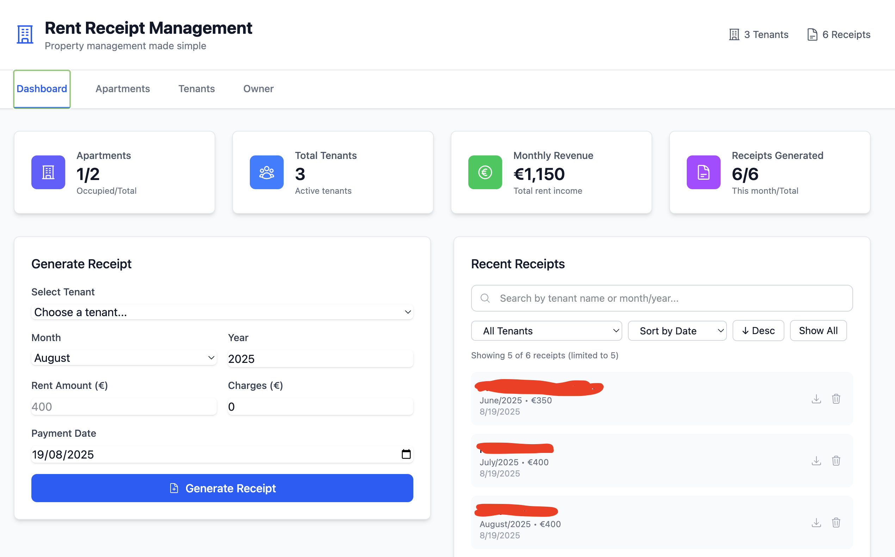

# 🏠 ImmoFacile - Immobilier Facile



**ImmoFacile** is a modern fullstack web application for property managers to handle tenant information and generate rent receipts with ease. Built with React, Node.js, and designed specifically for French property management requirements.

## ✨ Features

### 🔐 Authentication
- JWT-based login (24-hour tokens) protecting every API route
- Default admin account seeded on first start (`ADMIN_USERNAME` / `ADMIN_PASSWORD`)
- Admin-only user registration

### 👥 Tenant Management
- Complete CRUD operations for tenant information
- Store contact details, rental amounts, and charges
- Auto-fill rent amounts when generating receipts

### 🏠 Apartment Management
- Full CRUD for apartments, linked to their tenants
- Combined "apartments with tenants" listing

### 🧾 Receipt Generation
- Generate PDF rent receipts in French ("Quittance de Loyer")
- Customizable payment dates for accurate record-keeping
- Professional formatting with landlord signature support
- Automatic filename generation with tenant and period info
- **Email delivery**: Automatically send receipts to tenants via email

### 📊 Receipt Management
- **Advanced Search**: Search by tenant name or month/year
- **Smart Filtering**: Filter receipts by specific tenants
- **Flexible Sorting**: Sort by date, tenant name, or rental period
- **View Options**: Toggle between recent receipts and complete history
- Download and delete receipts with one click
- **Email receipts**: Send existing receipts to tenants via email
- **Email Status Tracking**: Visual indicators show which receipts have been emailed
- **Duplicate Prevention**: Prevents accidental duplicate email sending
- **Payment tracking**: Mark receipts paid/unpaid, record payments, and filter by payment status

### ⏰ Rent Reminders
- Scheduled overdue-rent reminder emails (configurable cron)
- Manual trigger, start/stop controls and statistics (admin only)
- Every reminder carries a GDPR privacy notice about open tracking

### 🎨 Modern Interface
- Clean, responsive design built with React and Tailwind CSS
- French UI with URL-routed tabs (#tenants, #apartments, …) and real-time notifications
- Intuitive dashboard with key statistics
- Mobile-friendly responsive layout

## 🛠️ Tech Stack

### Backend
- **Node.js** (≥22.12) with **Express 5**
- **SQLite** database for data persistence
- **JWT authentication** (jsonwebtoken + bcryptjs password hashing)
- **PDFKit** for professional PDF receipt generation
- **Nodemailer** for email delivery with PDF attachments
- **node-cron** reminder scheduler
- **Security middleware**: Helmet, CORS, Rate limiting, input validation
- Environment-based configuration with startup validation

### Frontend
- **React 19** with Vite 8 for fast development
- **Redux Toolkit** for state management
- **Tailwind CSS v4** for modern styling
- **Heroicons** and **lucide-react** for consistent iconography
- **Axios** for API communication (JWT attached automatically)
- **Vitest** + React Testing Library for tests

## Project Structure

```
immo-facile/
├── server/
│   ├── src/
│   │   ├── config/          # Shared app configuration & env validation
│   │   ├── controllers/     # Request handlers
│   │   ├── middleware/      # JWT auth, file uploads
│   │   ├── models/          # Data models
│   │   ├── routes/          # API routes (/api/*)
│   │   ├── services/        # Business logic (auth, receipts, reminders, tracking)
│   │   ├── templates/       # Email templates
│   │   ├── database/        # Database setup
│   │   └── utils/           # PDF generation, email, pagination, privacy
│   ├── database/            # SQLite database files (generated)
│   ├── receipts/            # Generated PDF files (generated)
│   └── index.js             # Server entry point
└── client/
    ├── src/
    │   ├── components/      # React components
    │   ├── pages/           # Tab pages (Tenants, Apartments, Owner, Reminders, Login)
    │   ├── store/           # Redux store and slices
    │   ├── services/        # API services
    │   ├── hooks/           # Custom hooks
    │   ├── i18n/            # French strings
    │   └── App.jsx          # Main app component
    └── public/              # Static assets
```

## 🚀 Getting Started

### Prerequisites
- Node.js ≥ 22.12 (see `engines` in the package.json files)
- npm ≥ 10

### Quick Start

1. **Clone the repository**
   ```bash
   git clone <repository-url>
   cd immo-facile
   ```

2. **Install dependencies** (three packages: root, `client/`, `server/`)
   ```bash
   npm run install:all
   ```

3. **Configure the server**
   ```bash
   cp server/.env.example server/.env
   ```
   Edit `server/.env` — set a strong `JWT_SECRET` and change the seeded
   admin credentials (`ADMIN_USERNAME` / `ADMIN_PASSWORD`) before first start.

4. **Start the backend**
   ```bash
   npm run dev:server
   ```
   Server runs on http://localhost:5001

5. **Start the frontend** (in a new terminal)
   ```bash
   npm run dev:client
   ```
   Client runs on http://localhost:5173

6. **Configure Email (Optional)**
   To enable email functionality, add email configuration to your server `.env` file:
   ```bash
   # For Gmail (recommended)
   EMAIL_HOST=smtp.gmail.com
   EMAIL_PORT=587
   EMAIL_SECURE=false
   EMAIL_USER=your-email@gmail.com
   EMAIL_PASSWORD=your-app-password
   ```

   **📧 Gmail Setup Guide**: See the detailed Gmail configuration section below.

7. **Access the application**
   Open your browser and navigate to http://localhost:5173, then log in with
   the seeded admin credentials.

## 📡 API Endpoints

All routes live under `/api` (no version prefix) and require a JWT
`Authorization: Bearer <token>` header, except the public paths noted below.
List endpoints support pagination via `?page=` and `?limit=` (capped at 50).

### Auth
- `POST /api/auth/login` - Log in, returns a JWT *(public)*
- `GET /api/auth/me` - Current user from token
- `POST /api/auth/register` - Create a user *(admin only)*
- `GET /api/health` - Health probe *(public)*

### Tenants
- `GET /api/tenants` - Get all tenants (paginated)
- `POST /api/tenants` - Create new tenant
- `PUT /api/tenants/:id` - Update tenant
- `DELETE /api/tenants/:id` - Delete tenant

### Apartments
- `GET /api/apartments` - Get all apartments (paginated)
- `GET /api/apartments/with-tenants` - Apartments with their tenants
- `POST /api/apartments` - Create apartment
- `GET /api/apartments/:id` - Get one apartment
- `PUT /api/apartments/:id` - Update apartment
- `DELETE /api/apartments/:id` - Delete apartment

### Receipts
- `POST /api/receipts/generate` - Generate new receipt (with payment date and optional email sending)
- `GET /api/receipts` - Get all receipts (paginated)
- `GET /api/receipts/tenant/:tenantId` - Get receipts by tenant
- `GET /api/receipts/download/:id` - Download receipt PDF
- `POST /api/receipts/email/:id` - Send existing receipt via email
- `PATCH /api/receipts/:id/payment-status` - Update payment status
- `POST /api/receipts/:id/record-payment` - Record a payment
- `GET /api/receipts/payment-status/:status` - Filter receipts by payment status
- `GET /api/receipts/:id/payment-history` - Payment history for a receipt
- `DELETE /api/receipts/:id` - Delete receipt

### Owner
- `GET /api/owner` - Get owner identity
- `POST /api/owner` / `PUT /api/owner` - Create / update owner
- `POST /api/owner/signature` - Upload signature image (multipart)
- `GET /api/owner/signature` - Retrieve signature image

### Reminders
- `GET /api/reminders/status` - Scheduler status
- `GET /api/reminders/statistics` - Reminder statistics
- `POST /api/reminders/trigger` - Trigger a manual check *(admin only)*
- `PUT /api/reminders/config` - Update reminder config *(admin only)*
- `POST /api/reminders/start` / `POST /api/reminders/stop` - Start / stop scheduler *(admin only)*

### Email tracking
- `GET /api/email-tracking/pixel/:token` - Email-open tracking pixel *(public)*
- `GET /api/receipts/track/:token` - Receipt open tracking (used by embedded email pixels)
- `GET /api/email-tracking/analytics` - Open-rate analytics
- `GET /api/email-tracking/clients` - Email client stats
- `GET /api/email-tracking/devices` - Device stats

## ⚙️ Environment Variables

Copy `server/.env.example` to `server/.env` and adjust:

```env
PORT=5001
NODE_ENV=development
DB_PATH=./database/rentReceipts.db
RECEIPTS_DIR=./receipts
CORS_ORIGIN=http://localhost:3000

# Authentication — REQUIRED in production; seeds the default admin account
JWT_SECRET=change-me-to-a-long-random-string
ADMIN_USERNAME=admin
ADMIN_PASSWORD=changeme123

# Email Configuration (Required for email functionality)
EMAIL_HOST=smtp.gmail.com
EMAIL_PORT=587
EMAIL_SECURE=false
EMAIL_USER=your-email@gmail.com
EMAIL_PASSWORD=your-app-password

# Server URL used in email-open tracking pixels
SERVER_URL=http://localhost:5001

# Reminder scheduler
REMINDERS_ENABLED=true
REMINDER_SCHEDULE=0 9 * * *
TZ=Europe/Paris
```

Optional extras: `TRACKING_PEPPER` (pepper for hashed IPs in email tracking,
defaults to a fixed value) and `LANDLORD_NAME` / `LANDLORD_ADDRESS1` /
`LANDLORD_ADDRESS2` / `LANDLORD_SIGNATURE` (override landlord identity printed
on receipts).

### Client (.env)
```env
VITE_API_URL=http://localhost:5001/api
```
In development the client falls back to `http://localhost:5001/api` when
`VITE_API_URL` is unset. Production builds use relative `/api`
(see `client/.env.production`).

## 📧 Gmail Configuration for Property Owners

To enable automatic email delivery of rent receipts to your tenants, follow these steps to configure Gmail:

### Step 1: Enable 2-Factor Authentication
1. Go to your [Google Account settings](https://myaccount.google.com/)
2. Navigate to **Security** → **2-Step Verification**
3. Follow the prompts to enable 2FA (required for App Passwords)

### Step 2: Generate App Password
1. In your Google Account, go to **Security** → **App passwords**
2. Select **Mail** as the app and **Other (custom name)** as the device
3. Enter "ImmoFacile" as the custom name
4. Click **Generate** - Google will provide a 16-character password
5. **Important**: Copy this password immediately (you won't see it again)

### Step 3: Configure Environment Variables
Add these settings to your server `.env` file:

```env
# Gmail Configuration
EMAIL_HOST=smtp.gmail.com
EMAIL_PORT=587
EMAIL_SECURE=false
EMAIL_USER=your-property-email@gmail.com
EMAIL_PASSWORD=abcd efgh ijkl mnop
```

**Replace with your details:**
- `EMAIL_USER`: Your Gmail address (this will appear as the sender)
- `EMAIL_PASSWORD`: The 16-character App Password from Step 2

### Step 4: Test Email Configuration
1. Restart your server after adding the email configuration
2. Add a tenant with a valid email address
3. Generate a receipt with the "Send via email" option checked
4. Check that the email was sent successfully (check server logs)

### Alternative Email Providers

**For other email providers**, update the configuration accordingly:

**Outlook/Hotmail:**
```env
EMAIL_HOST=smtp-mail.outlook.com
EMAIL_PORT=587
EMAIL_SECURE=false
EMAIL_USER=your-email@outlook.com
EMAIL_PASSWORD=your-password
```

**Yahoo Mail:**
```env
EMAIL_HOST=smtp.mail.yahoo.com
EMAIL_PORT=587
EMAIL_SECURE=false
EMAIL_USER=your-email@yahoo.com
EMAIL_PASSWORD=your-app-password
```

### Email Features
- **Professional Templates**: Emails are sent in French with professional formatting
- **PDF Attachments**: Rent receipts are automatically attached as PDF files
- **Tenant Information**: Emails include tenant name, rental period, and payment details
- **Automatic Naming**: Email subjects include tenant name and rental period
- **Status Tracking**: Visual indicators show which receipts have been emailed
- **Duplicate Prevention**: System prevents sending the same receipt multiple times
- **Email History**: Timestamps track when emails were sent to tenants
- **Error Handling**: System gracefully handles email failures without breaking receipt generation

### Troubleshooting
- **"Authentication failed"**: Double-check your App Password and ensure 2FA is enabled
- **"Connection refused"**: Verify EMAIL_HOST and EMAIL_PORT settings
- **"Email not sent"**: Check server logs for detailed error messages
- **Missing emails**: Check tenant's spam/junk folder

## 🔒 Security Features

- **JWT authentication**: All API routes require a valid token except `/api/health`, `/api/auth/login` and the tracking pixel
- **Password hashing**: bcrypt with salt
- **Rate limiting**: 100 requests per 15 minutes per IP
- **CORS protection**: Configured for secure cross-origin requests
- **Security headers**: Helmet middleware for enhanced security
- **Input validation**: Server-side validation for all endpoints
- **SQL injection prevention**: Parameterized queries throughout

## 🏗️ Development

### Architecture Principles
- **Modular design**: Separated concerns with clear component boundaries
- **Environment-based config**: Different settings for dev/prod environments
- **Error handling**: Comprehensive error catching and user feedback
- **Clean code**: Consistent formatting and naming conventions
- **Responsive UI**: Mobile-first design approach

### Key Components
- **Login**: JWT authentication screen
- **Dashboard**: Statistics overview with quick actions
- **Tenant Management**: Full CRUD operations with form validation
- **Apartment Management**: CRUD for rental properties
- **Receipt Generation**: PDF creation with French formatting
- **Receipt Management**: Advanced search, filter, and sort capabilities
- **Owner Settings**: Owner identity and signature upload
- **Reminder Management**: Scheduler controls and statistics
- **Notifications**: Real-time user feedback system

## 🧪 Quality Assurance

This project includes automated quality checks to maintain code consistency and catch issues early.

### Pre-commit Hooks

When you commit code, the following checks run automatically:

- **Prettier**: Formats staged JavaScript/JSX files
- **ESLint**: Lints client code for errors and warnings

Pre-commit hooks are managed by [Husky](https://typicode.github.io/husky/) and [lint-staged](https://github.com/okonet/lint-staged).

### Available Scripts

Run these from the root directory:

| Script | Description |
|--------|-------------|
| `npm run install:all` | Install dependencies for root, client, and server |
| `npm run dev:server` | Start the API server with nodemon reload (port 5001) |
| `npm run dev:client` | Start the Vite dev server (port 5173) |
| `npm run build` | Production build of the client into `client/dist/` |
| `npm run start:prod` | Start the server in production mode (serves `client/dist/`) |
| `npm run build:prod` | Build the client then start the production server |
| `npm test` | Run client (vitest) and server (jest + coverage) tests |
| `npm run format` | Format all JS/JSX files with Prettier |
| `npm run format:check` | Check if files are properly formatted |
| `npm run lint` | Run ESLint on client and server code |
| `npm run lint:fix` | Auto-fix ESLint issues where possible |
| `npm run security:audit` | Run npm audit on client and server |
| `npm run ci:check` | Run all quality checks: format + lint + tests + build |

### GitHub Actions CI

On every push to `main`/`develop` and on pull requests, GitHub Actions automatically runs:

1. **Format Check** - Ensures code follows Prettier style
2. **Lint** - Runs ESLint on client and server
3. **Tests** - Client (Vitest) and server (Jest, with binding coverage thresholds)
4. **Security Audit** - Checks for vulnerable dependencies via an audit gate
5. **Build** - Verifies the client builds successfully

### Branch Protection (Recommended)

For team projects, enable branch protection on `main`:

1. Go to **Settings** → **Branches** → **Add rule**
2. Set **Branch name pattern**: `main`
3. Enable:
   - ✅ Require status checks to pass before merging
   - ✅ Require branches to be up to date before merging
   - ✅ Select the `quality` status check
4. Save changes

## 🤝 Contributing

1. Fork the repository
2. Create a feature branch (`git checkout -b feature/amazing-feature`)
3. Commit your changes (`git commit -m 'Add amazing feature'`)
4. Push to the branch (`git push origin feature/amazing-feature`)
5. Open a Pull Request

## 📄 License

This project is licensed under the MIT License - see the LICENSE file for details.

## 🆘 Support

If you encounter any issues or have questions:
1. Check the existing issues on GitHub
2. Create a new issue with detailed information
3. Include steps to reproduce any bugs

---

**ImmoFacile - Made with ❤️ for French property management**
